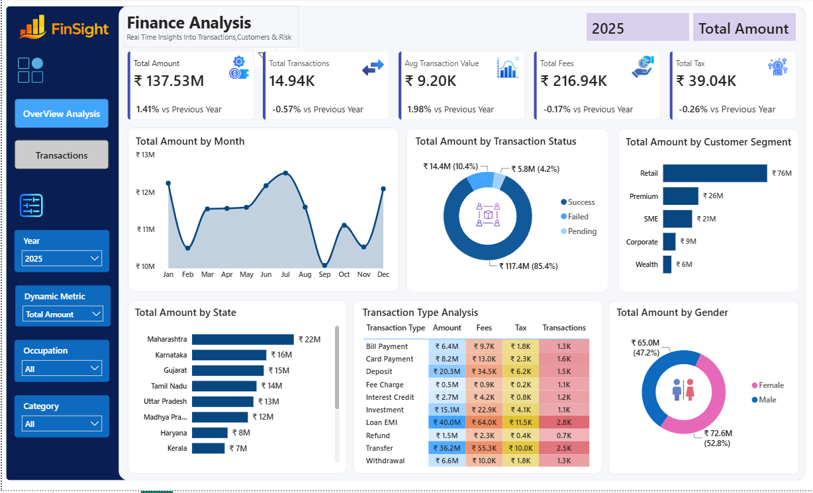
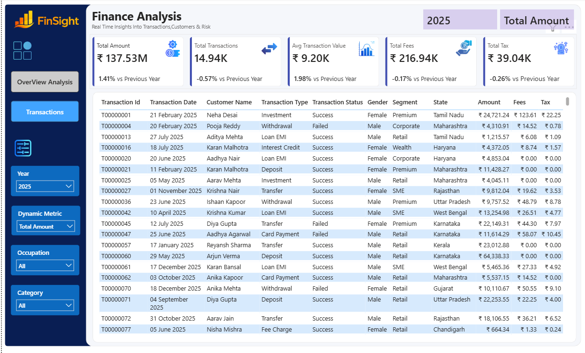

# Customers_Financial_Analysis

<h1 align="center">💰 FinSight - Finance Analytics Dashboard</h1>


# 📌 Project Overview

Financial institutions process thousands of transactions every day. Monitoring these transactions manually is difficult and time-consuming.

**FinSight** transforms raw financial data into meaningful business insights using interactive dashboards that help stakeholders monitor KPIs, identify trends, and make data-driven decisions.

---

# 🎯 Business Problem

The organization required a centralized dashboard to:

- 📈 Monitor financial performance
- 💹 Track yearly transaction growth
- ✅ Analyze transaction success rates
- 👥 Understand customer behavior
- 🌍 Compare regional performance
- 💰 Analyze transaction profitability
- 🧾 Track fees and taxes
- 📊 Support strategic business decisions

---

# 🛠 Tech Stack

| Technology | Purpose |
|------------|----------|
| 📊 Power BI | Dashboard Development |
| ⚡ Power Query | Data Cleaning & ETL |
| 🧮 DAX | KPI Calculations |
| 🗄 SQL | Data Analysis |
| 📑 Excel | Data Preparation |
| 📂 CSV | Dataset |

---

# 📂 Dataset

The project uses two datasets:

- 👤 Customers Dataset
- 💳 Finance Transactions Dataset

### Dataset Fields

- Transaction ID
- Customer Name
- Transaction Date
- Transaction Amount
- Transaction Type
- Transaction Status
- Fees
- Tax
- Gender
- Customer Segment
- Occupation
- State

---

# 📊 Dashboard Features

## 📌 KPI Cards

✔ Total Amount

✔ Total Transactions

✔ Average Transaction Value

✔ Total Fees

✔ Total Tax

✔ Year-over-Year Growth

---

## 🎛 Interactive Filters

- 📅 Year
- 📈 Dynamic Metric
- 💼 Occupation
- 🏷 Category

---

## 📉 Visualizations

| Visualization | Description |
|--------------|-------------|
| 📈 Monthly Trend | Analyze monthly transaction amount |
| 🍩 Transaction Status | Success vs Failed vs Pending |
| 👥 Customer Segment | Retail, SME, Premium, Corporate, Wealth |
| 🌍 State Analysis | Compare state-wise performance |
| 📊 Transaction Type | Matrix with Amount, Fees, Tax |
| 🚻 Gender Analysis | Male vs Female |
| 📄 Transaction Report | Detailed transaction records |

---

# 📈 Key Insights

✅ Retail customers generated the highest transaction amount.

✅ Successful transactions accounted for over **85%** of total transaction value.

✅ Maharashtra contributed the highest transaction volume.

✅ Loan EMI and Transfer generated the highest revenue.

✅ Monthly analysis revealed seasonal transaction trends.

✅ Female customers contributed slightly more transaction value than male customers.

---

# 📊 KPIs Used

| KPI |
|------|
| 💰 Total Amount |
| 🔄 Total Transactions |
| 📊 Average Transaction Value |
| 💵 Total Fees |
| 🧾 Total Tax |
| 📈 YoY Growth |
| ✅ Success Rate |
| ⚙ Dynamic Measure |

---

# ⚡ Power BI Features Used

- ⚡ Power Query
- 🧮 DAX Measures
- 🔗 Data Modeling
- 🎨 Conditional Formatting
- 📈 KPI Cards
- 🍩 Donut Charts
- 📊 Bar Charts
- 📉 Line Chart
- 📋 Matrix Visual
- 🎛 Dynamic Slicers
- 📖 Bookmarks
- 🔍 Drill-through
- 🧭 Navigation Buttons

---

# 🖼 Dashboard Preview

## 📊 Executive Dashboard

<p align="center">

</p>

---

## 📋 Transaction Dashboard

<p align="center">

</p>

---

# 📁 Project Structure

```text
Finance-Analytics-Dashboard
│
├── Finance_Analysis.pbix
├── finance_transactions.csv
├── customers.csv
├── Output_1.png
├── Output_2.png
├── README.md
└── Business Requirements.docx
```

---

# 🚀 Business Impact

The dashboard enables organizations to:

- 📈 Monitor financial KPIs
- 📊 Improve operational efficiency
- 💰 Identify profitable customer segments
- 🌍 Compare regional performance
- 👥 Analyze customer demographics
- 📉 Track financial trends
- 🎯 Make data-driven business decisions

---


# 👨‍💻 Author

<div align="center">

## CH. Ravi Teja

🎓 **B.Tech – Data Science**

📊 **Aspiring Data Analyst**

[](https://www.linkedin.com/in/ch-ravi-teja-b00139367/)

[](https://github.com/Raviteja0710)

</div>

---

<div align="center">

### ⭐ If you found this project useful, please consider giving it a star!

**Thank you for visiting this repository! ❤️**

</div>
